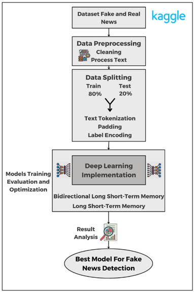
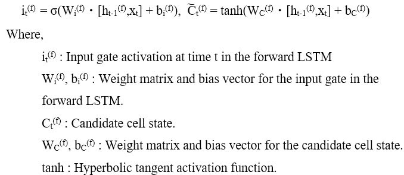
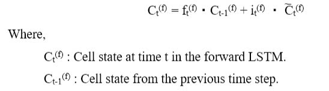
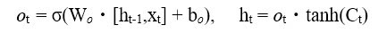
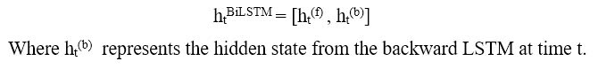
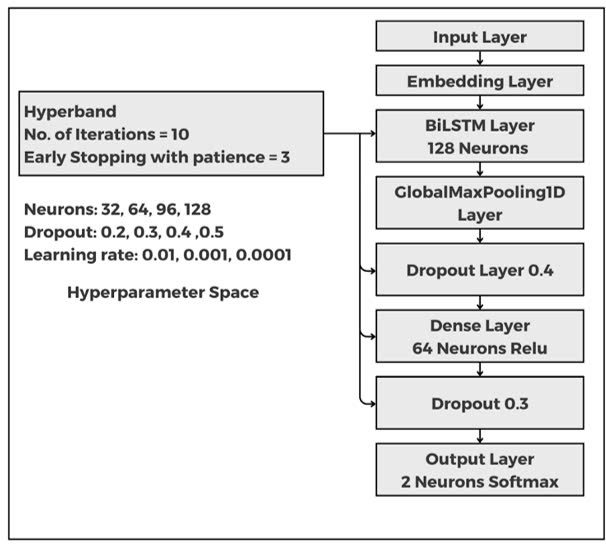
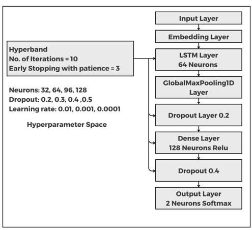
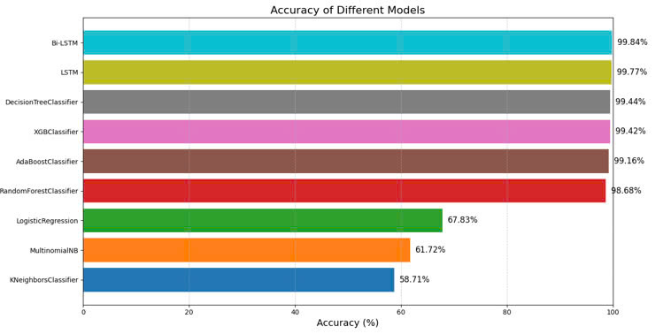

# Fake-News-Detection

## 1. Introduction

The aim of this research is to analyze existing studies on fake news detection, focusing on **optimizing established models** to enhance the ability to detect and classify fake information in the **security context**. This research employs two main methods: **LSTM (Long Short-Term Memory)** and **BiLSTM (Bidirectional Long Short-Term Memory)**, combined with **Hyperband**, an efficient hyperparameter optimization algorithm. The results of the study indicate that **Bi-LSTM outperforms other models, achieving the highest accuracy of 99.84%**, clearly demonstrating the advantage of processing context in both directions. Bi-LSTM's ability to extract information from both forward and backward sequences of data allows the model to gain a deeper understanding of the relationships between words in the text, thereby improving accuracy in fake news classification. Meanwhile, the **LSTM model also demonstrates strong performance, achieving an accuracy of 99.77%**, due to its ability to capture sequential dependencies, making it a robust choice for detecting patterns in textual data. Therefore, this research contributes to **enhancing the performance of deep learning models in security applications**.

## 2. Methodology

### Proposed Framework

The framework for fake news detection starts with two datasets (fake and true) from Kaggle. The data undergoes preprocessing, including text cleaning and processing. After splitting into training (80%) and testing (20%) sets, feature engineering is applied: text is tokenized, padded for consistent length, and labels are encoded numerically. The framework employs BiLSTM and LSTM models to capture long-term and bidirectional dependencies. The models are trained, evaluated, and optimized, with the best-performing model selected for deployment.

  

### Workflow description of the proposed framework

**Data Cleaning:** The datasets are combined into one, shuffled to prevent ordering bias, and cleaned by removing 6251 duplicate entries. Only the "text" and "label" columns are retained for further processing, while "title," "subject," and "date" columns are discarded as they do not contribute to the classification task.

**Text Processing:** The text data is processed using a custom function that removes extra whitespace, special characters, and single-character words. It converts all text to lowercase, tokenizes it into words, and removes stopwords. The remaining words are lemmatized to their root forms, and words shorter than three characters are discarded. This preprocessing optimizes the dataset for training deep learning models.

**Data Splitting:** The processed text data is split into training (80%) and testing (20%) sets to evaluate the model's performance on unseen data and assess its generalization ability.

**Tokenizing and Padding Text:** Tokenization converts each text sample into a sequence of integers, where each word is assigned a unique ID. For a text sequence T of length L, each word wᵢ is represented as tᵢ = token_index(wᵢ). Padding is then applied to standardize sequence length, with shorter sequences padded with zeros and longer ones truncated. In this case, sequences are padded to a maximum length of 150 tokens.

**Transforming Labels:** The labels are encoded as integers (0 for 'fake news' and 1 for 'true news'), then one-hot encoded using Keras' to_categorical function. For binary classification, the labels are represented as [1, 0] for 'fake news' and [0, 1] for 'true news', ensuring compatibility with deep learning models.

### BiLSTM
The BiLSTM model enhances text processing by analyzing sequences in both forward and backward directions, capturing contextual dependencies from both the past and future. This improves the model's ability to distinguish real from fake news.

To optimize performance, the Hyperband algorithm is used for hyperparameter tuning, focusing on:

- Neurons: {32, 64, 96, 128}
  
- Dropout rate: {0.2, 0.3, 0.4, 0.5}
  
- Learning rate: {0.01, 0.001, 0.0001}

Hyperband runs 10 iterations with early stopping (patience = 3) to identify the optimal hyperparameters efficiently.

The BiLSTM model consists of two LSTM layers: one processes input sequences in the forward direction, while the other processes them in reverse. The outputs of these two layers are concatenated at each time step to capture contextual information from both perspectives.
The forward LSTM updates its states as follows:

  **1. Forget Gate:**

  

**2. Input Gate:**

  

**3. Cell State:**

  

**4. Output Gate and Hidden State:**

  

The backward LSTM operates similarly but processes the sequence in reverse. At each time step, the hidden states from both directions, ht(f)  and ht(b) are concatenated:

  

**Model Architecture:**

  

### LSTM

The LSTM model enhances text processing by analyzing sequences in the forward direction, capturing contextual dependencies from the past. This improves the model's ability to distinguish real from fake news.

To optimize performance, the Hyperband algorithm is used for hyperparameter tuning, focusing on:

- Neurons: {32, 64, 96, 128}

- Dropout rate: {0.2, 0.3, 0.4, 0.5}
 
- Learning rate: {0.01, 0.001, 0.0001}
 
Hyperband runs 10 iterations with early stopping (patience = 3) to identify the optimal hyperparameters efficiently.

The LSTM model includes the same operations as BiLSTM, but only with the forward layer.

**Model Architecture:**

  

## 3. Experiment Result

### Dataset Description

In this study, we utilized the Fake and Real News datasets provided on Kaggle. 

Datasets link: https://www.kaggle.com/datasets/clmentbisaillon/fake-and-real-news-dataset/data

The dataset consists of two separate files:  

- Fake.csv: containing 23,502 articles labeled as fake news.
  
- True.csv: containing 21,417 articles labeled as true news.

The dataset is balanced, with 52.3% fake news and 47.7% true news, enabling effective model training and evaluation without additional data balancing.

**Dataset Variable Descriptions**

**Title:**	the title of the news article

**Text:**	the main body text of the news article. 

**Subject:**	the subject of the news article. 

**Data:**	the publication date of the news article.  

### Evaluation metrics

Accuracy was used to evaluate the models as it is effective for balanced datasets. It measures the proportion of correct predictions out of all samples, providing a clear assessment of model performance. The formula is:

Accuracy = (Number of Correct Predictions)/(Total Number of Samples)

### Compare the results of the proposed model with machine learning algorithms.

Here is the comparison of accuracy scores for different models used in fake news detection. 

The **Bidirectional Long Short-Term Memory (Bi-LSTM) model** demonstrated outstanding performance in the task of fake news detection, achieving **the highest accuracy of 99.84%**. This exceptional result highlights the model's ability to capture both past and future contextual dependencies in text data, making it particularly effective for natural language processing (NLP) tasks like fake news classification. The **Long Short-Term Memory (LSTM) model** achieved a slightly lower accuracy of **99.77%**, indicating that its unidirectional nature leads to a small performance gap. Although both models excel at extracting sequential and temporal patterns, the ability of Bi-LSTM to capture the context in both directions provides it with an accuracy advantage. Compared to traditional machine learning models such as XGBoost or Random Forest, both LSTM and Bi-LSTM excel in sequential data tasks, demonstrating superior capability in handling the complex relationships present in text classification. However, **the tradeoff for this accuracy is the increased training time and computational requirements**, which are significantly higher than simpler models like Logistic Regression or MultinomialNB.

The **Decision Tree Classifier** achieved a higher accuracy of **99.44%**, outperforming the **Random Forest Classifier**, which achieved **98.78%**. This result can be explained by several factors. A Decision Tree is a simple model that makes decisions based on the features in the data. It can achieve high accuracy when the data is well-suited to its structure, but it tends to overfit when dealing with complex or noisy data. On the other hand, Random Forest is an ensemble method that combines multiple decision trees, reducing overfitting and improving performance, especially in complex datasets. Despite this, in this specific case, **the single Decision Tree outperformed the Random Forest, possibly due to the simplicity and suitability of the data for the Decision Tree's structure**. However, Random Forest is generally more robust and less prone to overfitting, making it a better choice for more complex and noisy data.

**XGBoost** stands out as one of the top-performing models, achieving an accuracy of **99.42%**. Its gradient-boosting mechanism enables it to optimize weak learners and build a robust classifier. While slightly less accurate than LSTM-based models, XGBoost offers practical advantages such as faster training times and lower computational demands. Similarly, **AdaBoost** also demonstrates strong performance with an accuracy of **99.16%**. By combining multiple weak classifiers, like decision stumps, into a single powerful model, AdaBoost effectively focuses on harder samples during training. Although it may not match the performance of more advanced ensemble methods like XGBoost, AdaBoost remains a highly competitive option due to its simplicity and effectiveness across various classification tasks, including fake news detection.

The **Logistic Regression**, **Multinomial Naive Bayes (MNB)**, and **KNN** performed significantly lower than the more advanced models. Logistic Regression achieved **67.83%**, MultinomialNB scored **61.72%**, and KNN had the lowest accuracy at **58.71%**. These models are relatively simple and are commonly used for classification tasks, but they struggle to handle complex relationships in sequential data, particularly in NLP tasks like fake news detection. Logistic Regression, being a linear model, cannot capture non-linear relationships in text, which severely limits its ability to perform well in tasks like fake news classification. Similarly, MultinomialNB, while effective for text classification based on word frequencies, assumes independence between features, which is not true for sequential data where word dependencies matter. KNN, which relies on distance-based metrics, also faces challenges when dealing with high-dimensional text data and large datasets, resulting in poor performance for fake news detection. These models are fast and computationally inexpensive but fail to offer the predictive accuracy and contextual understanding provided by more sophisticated models like Bi-LSTM or LSTM.

## 4. Conclusion

This project proposes a fake news detection method by primarily evaluating two models: Bi-LSTM and LSTM, with other models such as XGBoost, Decision Tree, AdaBoost, Random Forest, Logistic Regression, Multinomial Naive Bayes, and KNN. Bi-LSTM outperformed all other models, achieving the highest accuracy of 99.84%, clearly demonstrating the advantage of bidirectional context processing. The ability of Bi-LSTM to extract information from both the forward and backward sequences of the data allowed the model to gain a deeper understanding of the relationships between words in the text, significantly enhancing its ability to classify fake news. Meanwhile, LSTM achieved an accuracy of 99.77%, which, while still impressive, highlights the limitations of its unidirectional approach in capturing the full context of the text. To optimize these models and further enhance their performance, both Bi-LSTM and LSTM were fine-tuned using the Hyperband algorithm, which efficiently searched for the best hyperparameter configurations. The use of Hyperband played a crucial role in maximizing the models' potential, ensuring that the best hyperparameter settings were selected, which contributed to the improved results observed for both models.
